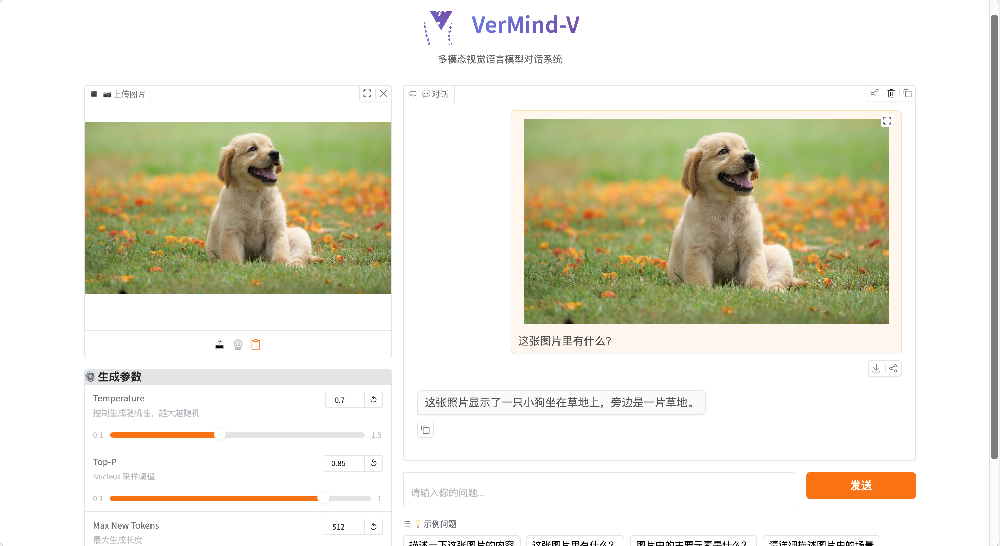

# VerMind-V (VLM)

This document covers the **vision-language** workflow for VerMind-V: training, evaluation, and the Gradio web demo.

<p align="center">
  
</p>

## What’s in this repo (VLM)

- Training: `train/train_vlm.py`
- Dataset loader: `data_loader/vlm_dataset.py`
- Web demo: `scripts/web_demo.py`
- Eval / inference: `scripts/eval_vlm.py`

## Install

```bash
git clone https://github.com/nev8rz/vermind.git
cd vermind
uv venv && source .venv/bin/activate
uv pip install -e .
```

## Data format (VLM)

From `data_loader/vlm_dataset.py`:

- Parquet file with columns:
  - `image_bytes`: raw image bytes
  - `conversations`: JSON string, list of turns, each with `content`
- The dataset replaces `<image>` with the model’s image token sequence.

## Web Demo (Gradio)

```bash
python scripts/web_demo.py \
  --model_path /path/to/vlm_checkpoint \
  --device cuda
```

Required: `--model_path` must contain the model weights and `config.json`.

## Eval / Inference

### Local inference

```bash
python scripts/eval_vlm.py --model_path /path/to/vlm_checkpoint --device cuda
```

### OpenAI-compatible API mode

If you have an OpenAI-compatible server running:

```bash
python scripts/eval_vlm.py --use_api --api_base http://localhost:8000/v1 --model vermind-v
```

## Training entry point

```bash
python train/train_vlm.py --stage pretrain --from_weight ./output/sft/full_sft_768 --data_path ./dataset/vlm_pretrain.parquet
python train/train_vlm.py --stage sft --from_weight ./output/vlm_pretrain/vlm_pretrain_768 --data_path ./dataset/sft_data.parquet
```
